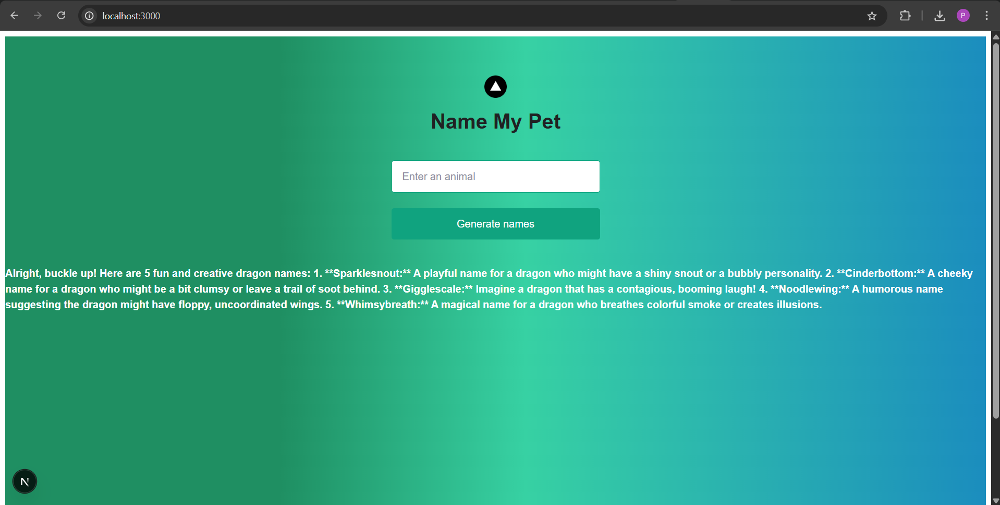
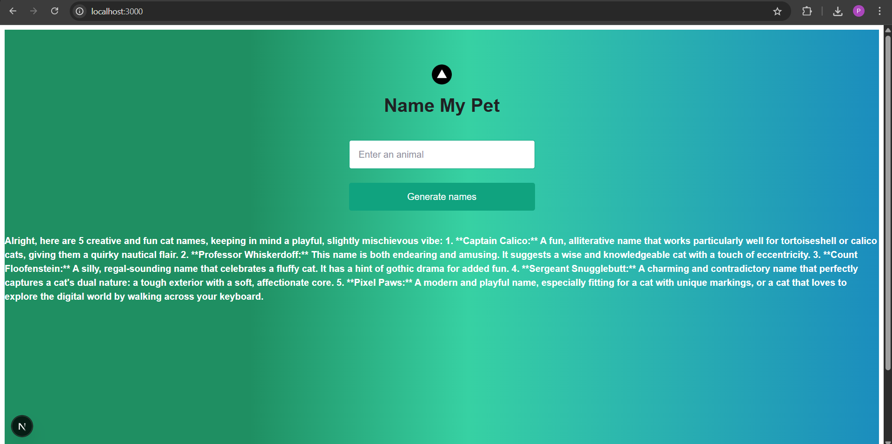

# **Animal Name Generation with Gemini AI** 🚀

This project provides a simple API endpoint for generating creative animal names using Gemini AI. The API takes an animal name as input and returns a list of fun and unique names for that animal.

---

## **Tech Stack** 💻

**Gemini AI**, model: v1beta(gemini-2.0-flash)
**Node JS**  
**React and Next.js**

---

## **Output:** 🖼️

