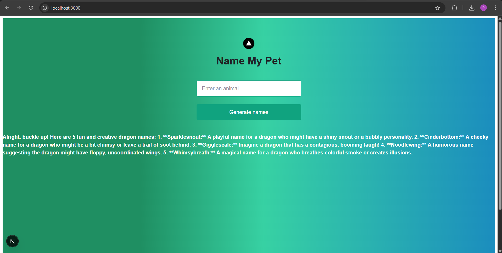
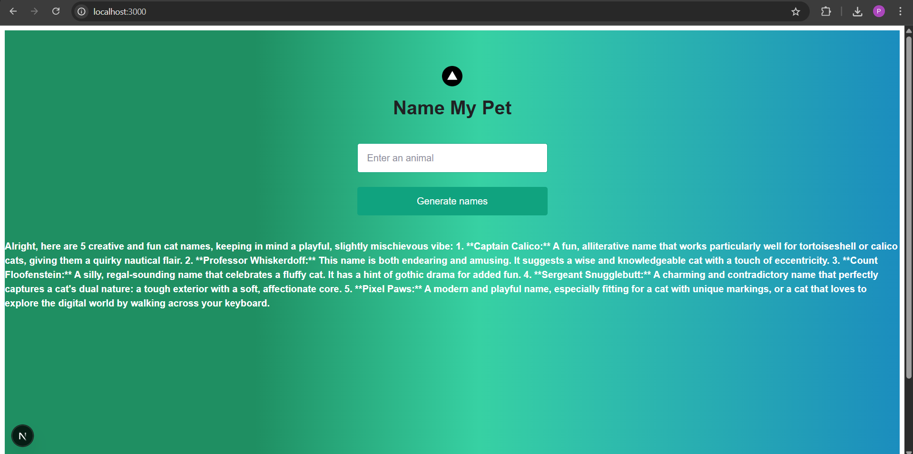

Animal Name Generation with Gemini AI
This project provides a simple API endpoint for generating creative animal names using Gemini AI. The API takes an animal name as input and returns a list of fun and unique names for that animal.

Tech Stack
Gemini AI: Used for natural language processing and name generation.

Node.js: Server-side environment for the API.

Axios: HTTP client for making API requests to Gemini.

dotenv: For managing environment variables securely.

Output:

